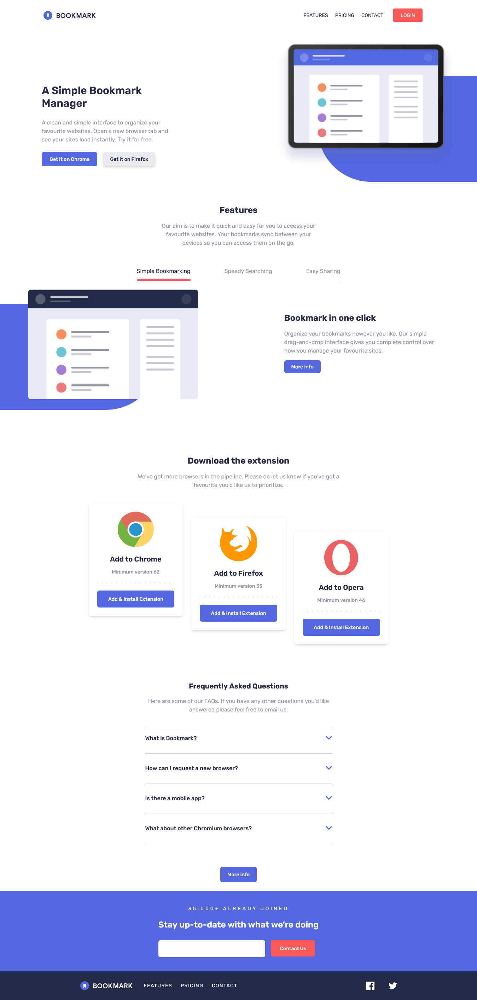

# Frontend Mentor - Bookmark landing page solution

This is a solution to the [Bookmark landing page challenge on Frontend Mentor](https://www.frontendmentor.io/challenges/bookmark-landing-page-5d0b588a9edda32581d29158). Frontend Mentor challenges help you improve your coding skills by building realistic projects.

## Table of contents

- [Overview](#overview)
  - [The challenge](#the-challenge)
  - [Screenshot](#screenshot)
  - [Links](#links)
  - [Built with](#built-with)
  - [What I learned](#what-i-learned)
- [Author](#author)

## Overview

### The challenge

Users should be able to:

- View the optimal layout for the site depending on their device's screen size
- See hover states for all interactive elements on the page
- Receive an error message when the newsletter form is submitted if:
  - The input field is empty
  - The email address is not formatted correctly

### Screenshot



### Links

- Solution URL: [github](https://github.com)

## My process

### Built with

- Semantic HTML5 markup
- Tailwind
- Flexbox
- CSS Grid
- Mobile-first workflow
- [React](https://reactjs.org/) - JS library
- [Next.js](https://www.typescriptlang.org/) - extends JavaScript by adding types to the language.

### What I learned

Use this section to recap over some of your major learnings while working through this project. Writing these out and providing code samples of areas you want to highlight is a great way to reinforce your own knowledge.

To see how you can add code snippets, see below:

```js
function Faqs() {
  const [selectedFaq, setSelectedFaq] = (useState < number) | (null > null);

  function handleSelectedFaq(id: number) {
    setSelectedFaq((prev) => (prev === id ? null : id));
  }
  return (
    <section className="mx-auto max-w-xl p-6 flex flex-col">
      <div className="flex flex-col gap-4 justify-center  mb-10">
        <h3 className="text-xl font-bold text-darkBlue text-center">
          {" "}
          Frequently Asked Questions
        </h3>
        <p className="text-blue text-base text-center">
          Here are some of our FAQs. If you have any other questions you’d like
          answered please feel free to email us.
        </p>
      </div>
      <div className="flex flex-col  gap-3 border-t border-blue mb-16">
        <Faq
          id={1}
          selectedFaq={selectedFaq}
          onSelect={handleSelectedFaq}
          question="What is Bookmark?"
          desc="Lorem ipsum dolor sit amet, consectetur adipiscing elit. Fusce tincidunt justo eget ultricies fringilla. Phasellus blandit ipsum quis quam ornare mattis."
        />
        <Faq
          id={2}
          selectedFaq={selectedFaq}
          onSelect={handleSelectedFaq}
          question=" How can I request a new browser? "
          desc="Vivamus luctus eros aliquet convallis ultricies. Mauris augue massa, ultricies non ligula. Suspendisse imperdiet. Vivamus luctus eros aliquet convallis ultricies. Mauris augue massa, ultricies non ligula. Suspendisse imperdie tVivamus luctus eros aliquet convallis ultricies. Mauris augue massa, ultricies non ligula. Suspendisse imperdiet."
        />
        <Faq
          id={3}
          selectedFaq={selectedFaq}
          onSelect={handleSelectedFaq}
          question="Is there a mobile app? "
          desc="Sed consectetur quam id neque fermentum accumsan. Praesent luctus vestibulum dolor, ut condimentum urna vulputate eget. Cras in ligula quis est pharetra mattis sit amet pharetra purus. Sed sollicitudin ex et ultricies bibendum."
        />
        <Faq
          id={4}
          selectedFaq={selectedFaq}
          onSelect={handleSelectedFaq}
          question="What about other Chromium browsers?"
          desc="Integer condimentum ipsum id imperdiet finibus. Vivamus in placerat mi, at euismod dui. Aliquam vitae neque eget nisl gravida pellentesque non ut velit."
        />
      </div>
      <button className="text-white font-medium text-sm bg-softBlue py-3 px-5 rounded-md self-center">
        More info
      </button>
    </section>
  );
}
```

## Author

- Frontend Mentor - [@Oloude](https://www.frontendmentor.io/profile/Oloude)
- Twitter - [@AbosedeOloude](https://www.twitter.com/AbosedeOloude)
